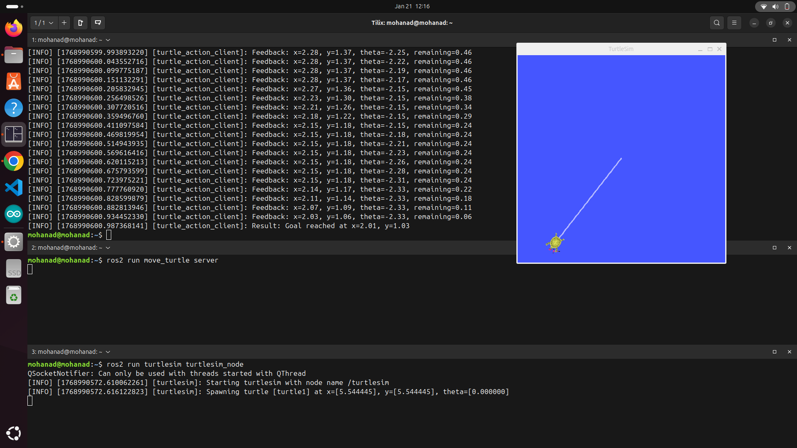

# ROS 2 Action Server

This repository demonstrates **ROS 2 Action Servers** with example code, explanations, and projects using them.  

Actions in ROS 2 are used when you want to **send a goal to a node**, get **continuous feedback** about the goal's progress, and finally receive the **result** when the goal completes. 

Ros2 Actions are suitable for **long running tasks** as navigation tasks

Think of it like giving someone a task, **checking in as they progress**, and then finally confirming the task is completed successfully. ✅  

---

## Concept of ROS 2 Actions

A ROS 2 Action consists of three main components:

1. **Action Server** – The node that executes the goal.  
2. **Action Client** – The node that sends the goal and monitors progress.  
3. **Action Definition** – The `.action` file defining **Goal**, **Result**, and **Feedback**.

> The action topic name must be **the same** in both the client and the server.  

---

### Anatomy of a `.action` file

Before creating an action server, we need to define a `.action` file.  
This file contains three parts:

1. **Goal** – What the client wants the server to do.  
2. **Result** – What the server returns after completing the goal.  
3. **Feedback** – Continuous updates about the goal's progress.
---
### How the Ros2 Actions work
looking at the photo below

first, the Client sends a service Request (mean sending a goal) like if I have a robot i will make it go to explore a place I gave it a goal to go to it. 

then, the server recive the request, and give a response that will be Goal Accepted.

after that it starts reaching the goal in the robot case it moves to the goal, and sends feedback to the client to tell me how far it go.

when the robot reach the goal, client make a second service request to the result if the robot reached the goal or not.

the server sends a response with the result to client.

and this is how the Actions work.

as we know from the advantges of the Actions that you can cancel the goal at anytime and send new one


---

Example: `DiffDrive.action`

```plaintext
# Goal
int32 distance  # distance to move in meters
---
# Result
bool success    # whether the goal was successful
---
# Feedback
int32 current_distance  # current distance covered
```
---
## first create a Ws lets say it's name is ros2_ws
**in the terminal**
```
mkdir ros2_ws
```
**then** make the src Directory to put inside it packges
* in the terminal
```
cd ros2_ws

mkdir src

cd src
```
* inside the src directory make a pkg to put inside it the .action file
```
ros2 pkg create --build-type ament_cmake action_pkg
```
>to clarify why we here use ament_cmake ,for build 
Python packages (ament_python) cannot run rosidl_generate_interfaces, so .action won’t be converted ,
Python nodes need generated classes to import the actions
Keeping actions in CMake package allows any node (Python or C++) to use the same action
* then we will make a directory called action inside  the action_pkg to put inside it the .action file
```
cd action_pkg
```
* then,
```
mkdir action
```

* and inside it make a file named Turtle.action (**take care** the name of the file must be the 1st letter Uppercase or Camelcase).

* inside it put the GOAL - RESPONSE - FEEDBACK  that you want.

* in my project we will take copypaste this code inside it.
```
#==== GOAL ====
float32 target_x
float32 target_y
float32 target_theta

---
#==== RESULT ====
float32 final_x
float32 final_y
float32 final_theta
string  message

---
#==== FEEDBACK ====
float32 current_x
float32 current_y
float32 current_distance
float32 current_theta
```

* go to the Cmakelist and open it in your editor (Vs code or nano) 
* for using vscode
```
code .
```
* for using nano
```
nano name of the file
```
and add this line After the line of :
```
find_package(rosidl_default_generators REQUIRED)

# Generate action interfaces
rosidl_generate_interfaces(${PROJECT_NAME}
  action/Turtle.action)
```
>take care if you changed the name of the .action name you change it also in the code\
here you can put any name
```
find_package(rosidl_default_generators REQUIRED)

# Generate action interfaces
rosidl_generate_interfaces(${PROJECT_NAME}
  action/nameofthefileyoumade.action)
```
* then open the packge.xml and add this dependecies 
add this after the buildtool
``` 
<buildtool_depend>rosidl_default_generators</buildtool_depend>
<depend>rclpy</depend>
<depend>geometry_msgs</depend>
<depend>turtlesim</depend>
<depend>rosidl_default_runtime</depend>
<member_of_group>rosidl_interface_packages</member_of_group>
```
* then after making all this return to the ros2_ws and start to build
```
cd ros2_ws
```
```
colcon build
```
* Now we finished the First Package we will continue the second part
---
## Second Making the Pyhton Client and server Nodes
after building lets make a package to put in it our python client and server nodes
```
cd src
```
```
ros2 pkg create --buikd-type ament_python move_turtle
```
* list the pkg to check that the packages are in the correct place
```
ls
```
* you should see
```
action_pkg    move_turtle
```
* then go inside package
```
cd move_turtle
```
* inside the package go to the move_turtle

* inside it make two files one for client and other for the server
```
touch Client.py
```
```
touch Server.py
```
* then
```
chmod +x Client.py
```
```
chmod +x Server.py
```
* when you make
```
ls
```
you must see them green
* then go inside the Server.py and paste this code 
```
import rclpy
from rclpy.node import Node
from geometry_msgs.msg import Twist
from turtlesim.msg import Pose
from rclpy.action import ActionServer
from math import sqrt, atan2, pi
from action_pkg.action import Turtle
import time

class TurtleActionServer(Node):
    def __init__(self):
        super().__init__('turtle_action_server')
        self.pub = self.create_publisher(Twist, '/turtle1/cmd_vel', 10)
        self.sub = self.create_subscription(Pose, '/turtle1/pose', self.pose_callback, 10)
        self.action_server = ActionServer(self, Turtle, 'turtle_action', self.execute_callback)

        self.x = None  # pose unknown initially
        self.y = None
        self.theta = None

    def pose_callback(self, msg):
        self.x = msg.x
        self.y = msg.y
        self.theta = msg.theta

    def execute_callback(self, goal_handle):
        goal = goal_handle.request
        result = Turtle.Result()
        feedback = Turtle.Feedback()

        # Wait until we have a valid pose
        while self.x is None:
            rclpy.spin_once(self)
            time.sleep(0.01)

        # Move to goal
        while True:
            dx = goal.target_x - self.x
            dy = goal.target_y - self.y
            distance = sqrt(dx**2 + dy**2)
            if distance < 0.05:
                break

            angle_to_goal = atan2(dy, dx)
            angular_diff = angle_to_goal - self.theta
            if angular_diff > pi:
                angular_diff -= 2*pi
            elif angular_diff < -pi:
                angular_diff += 2*pi

            cmd = Twist()
            # Rotate first if needed
            if abs(angular_diff) > 0.05:
                cmd.linear.x = 0.0
                cmd.angular.z = 0.5 if angular_diff > 0 else -0.5
            else:
                cmd.linear.x = 1.0
                cmd.angular.z = 0.0

            self.pub.publish(cmd)

            # Feedback
            feedback.current_x = self.x
            feedback.current_y = self.y
            feedback.current_theta = self.theta
            feedback.current_distance = distance
            goal_handle.publish_feedback(feedback)

            rclpy.spin_once(self)
            time.sleep(0.05)  # let turtlesim move

        # Stop turtle
        self.pub.publish(Twist())
        result.final_x = self.x
        result.final_y = self.y
        result.final_theta = self.theta
        result.message = "Goal reached"
        goal_handle.succeed()
        return result

def main():
    rclpy.init()
    node = TurtleActionServer()
    rclpy.spin(node)
    rclpy.shutdown()

if __name__ == "__main__":
    main()
```  
* and then inside the Client.py paste this code 
```
import rclpy
from rclpy.node import Node
from rclpy.action import ActionClient
from action_pkg.action import Turtle


class TurtleActionClient(Node):
    def __init__(self):
        super().__init__('turtle_action_client')
        self.client = ActionClient(self, Turtle, 'turtle_action')

    def send_goal(self, x, y, theta):
        self.client.wait_for_server()
        goal_msg = Turtle.Goal()
        goal_msg.target_x = x
        goal_msg.target_y = y
        goal_msg.target_theta = theta

        self._future = self.client.send_goal_async(
            goal_msg,
            feedback_callback=self.feedback_callback
        )
        self._future.add_done_callback(self.goal_response_callback)

    def goal_response_callback(self, future):
        goal_handle = future.result()
        if not goal_handle.accepted:
            self.get_logger().info('Goal rejected')
            return
        self.get_logger().info('Goal accepted')
        self._result_future = goal_handle.get_result_async()
        self._result_future.add_done_callback(self.result_callback)

    def feedback_callback(self, feedback_msg):
        feedback = feedback_msg.feedback
        self.get_logger().info(
            f"Feedback: x={feedback.current_x:.2f}, y={feedback.current_y:.2f}, "
            f"theta={feedback.current_theta:.2f}, remaining={feedback.current_distance:.2f}"
        )

    def result_callback(self, future):
        result = future.result().result
        self.get_logger().info(f"Result: {result.message} at x={result.final_x:.2f}, y={result.final_y:.2f}")
        rclpy.shutdown()

def main(args=None):
    rclpy.init(args=args)
    client = TurtleActionClient()
    client.send_goal(2.0, 1.0, 0.1)
    rclpy.spin(client)

if __name__ == '__main__':
    main()
```
**Take care you should Write the code with your hands try and this code is a reference code**

## Explaning The code 
**Client code**
```
import rclpy
from rclpy.node import Node
from rclpy.action import ActionClient
from action_pkg.action import Turtle
```
> first import the imp things like rclpy,node, and Action client to make the client object,and from the Action_pkg we made import the .action file

> this is the goal_msg when we give it parameters

>goal_msg = {
  target_x: 5.0,
  target_y: 5.0,
  target_theta: 1.57
}
```
class TurtleActionClient(Node):
    def __init__(self):
        super().__init__('turtle_action_client')
        self.client = ActionClient(self, Turtle, 'turtle_action')
``` 
> construct the class and make an Action client object, it takes the (self,Action type,Action name)
```
def send_goal(self, x, y, theta):
        self.client.wait_for_server()
        goal_msg = Turtle.Goal()
        goal_msg.target_x = x
        goal_msg.target_y = y
        goal_msg.target_theta = theta

        self._future = self.client.send_goal_async(
            goal_msg,
            feedback_callback=self.feedback_callback
        )
        self._future.add_done_callback(self.goal_response_callback)
```
> first make a send goal function that send the goal to the server, here it takes x,y,theta that are the goals in the .action file 

>secondly you wait for the server to be free or avaliable, then you create a goal_msg object by accses the Turtle.GOAL() that contain the three goals in the .action file 

> then send the goal to the server and wait for the feedback , the self.feedback_callback will be invoked when the server receive the goal

> and then take the response from the server as it finished or not
```
 def feedback_callback(self, feedback_msg):
        feedback = feedback_msg.feedback
        self.get_logger().info(
            f"Feedback: x={feedback.current_x:.2f}, y={feedback.current_y:.2f}, "
            f"theta={feedback.current_theta:.2f}, remaining={feedback.current_distance:.2f}"
        )
```
> here is the feedback_callback that is called by ros when there is a feedback from the server and store the feedback coming from the server in feedback_msg (it is a parameter ros give to callback as it contain the feedback msg), and then we take fro it the feedback we want
```
def goal_response_callback(self, future):
        goal_handle = future.result()
        if not goal_handle.accepted:
            self.get_logger().info('Goal rejected')
            return
        self.get_logger().info('Goal accepted')
        self._result_future = goal_handle.get_result_async()
        self._result_future.add_done_callback(self.result_callback)
```
> here in the goal response we see if the goal accepted,aborted,or canceled 

> and if accepted we store the result in the result_future and we print it using the result_callback 
```
    def result_callback(self, future):
        result = future.result().result
        self.get_logger().info(f"Result: {result.message} at x={result.final_x:.2f}, y={result.final_y:.2f}")
        rclpy.shutdown()
```
> here it is called when the server send the request for the result and it prints the final result and close ros 
```
def main(args=None):
    rclpy.init(args=args)
    client = TurtleActionClient()
    client.send_goal(2.0, 1.0, 0.1)
    rclpy.spin(client)

if __name__ == '__main__':
    main()
```
> here we initiate ros and make object from class and send the goal and spin the node.

**Server Code**
```
import rclpy
from rclpy.node import Node
from geometry_msgs.msg import Twist
from turtlesim.msg import Pose
from rclpy.action import ActionServer
from math import sqrt, atan2, pi
from action_pkg.action import Turtle
import time
```
> here we import the important things to use
---
```
class TurtleActionServer(Node):
    def __init__(self):
        super().__init__('turtle_action_server')
        self.pub = self.create_publisher(Twist, '/turtle1/cmd_vel', 10)
        self.sub = self.create_subscription(Pose, '/turtle1/pose', self.pose_callback, 10)
        self.action_server = ActionServer(self, Turtle, 'turtle_action', self.execute_callback)

        self.x = None  # pose unknown initially
        self.y = None
        self.theta = None
```
> here we make class and we make inside it a publisher that publish the velocity to move the turtle and we subscribe to the pose of the turtle , finally we make a server object.
```
def pose_callback(self, msg):
        self.x = msg.x
        self.y = msg.y
        self.theta = msg.theta
```
> this function will be called when subscribe to the Pose topic and put ros the Pose messeage in the msg object given to the function .
```
 def execute_callback(self, goal_handle):
        goal = goal_handle.request
        result = Turtle.Result()
        feedback = Turtle.Feedback()

        # Wait until we have a valid pose
        while self.x is None:
            rclpy.spin_once(self)
            time.sleep(0.01)

        # Move to goal
        while True:
            dx = goal.target_x - self.x
            dy = goal.target_y - self.y
            distance = sqrt(dx**2 + dy**2)
            if distance < 0.05:
                break

            angle_to_goal = atan2(dy, dx)
            angular_diff = angle_to_goal - self.theta
            if angular_diff > pi:
                angular_diff -= 2*pi
            elif angular_diff < -pi:
                angular_diff += 2*pi

            cmd = Twist()
            # Rotate first if needed
            if abs(angular_diff) > 0.05:
                cmd.linear.x = 0.0
                cmd.angular.z = 0.5 if angular_diff > 0 else -0.5
            else:
                cmd.linear.x = 1.0
                cmd.angular.z = 0.0

            self.pub.publish(cmd)

            # Feedback
            feedback.current_x = self.x
            feedback.current_y = self.y
            feedback.current_theta = self.theta
            feedback.current_distance = distance
            goal_handle.publish_feedback(feedback)

            rclpy.spin_once(self)
            time.sleep(0.05)  # let turtlesim move

        # Stop turtle
        self.pub.publish(Twist())
        result.final_x = self.x
        result.final_y = self.y
        result.final_theta = self.theta
        result.message = "Goal reached"
        goal_handle.succeed()
        return result
```
> Let's taik about this code , here when the server receive the goal ros call the excute_callback function and store the goal in goal_handle object called by ROS when a client sends a goal.

> first we make a goal object, result object, feedback object
>goal_handle → contains the goal request from the client.

>feedback → used to continuously send updates.

>result → sent to the client after the goal is finished.

> after we compute the distance and the angle we rotate the turtle to the goal
> and then we publish velocity to the turtle to move 

> then we send feedback and use publish_feedback() to publish the feedback to the client.

> and use time.sleep() to decrease the rate of sending feedback and make the turtle move.

> if we reach the distance we stop the turtle and put the x,y,theta we reached and send it at the result and make the goal_handle.succed(), and then return result to the client.
---
* then go to the setup.py and Add the Entery points inside the Entery point  
```
'server=move_turtle.Server:main',
'client=move_turtle.Client:main'
```
## Third Now we build the Ws again
* go to the ros2_ws 
```
cd ros2_ws
```
* build the ws 
```
colcon build 
```
* source the ws 
```
source install/setup.bash
```
## now we will run the project 
**First**
Open a Terminal and Source the ws 
```
source ~/ros2_ws/install/setup.bash
```
**then open another terminal**
```
source ~/ros2_ws/install/setup.bash
```
**run the Turtlesim node in a third terminal**
```
ros2 run turtlesim turtlesim_node
```
**run Client node in first terminal**
```
ros2 run move_turtle client
```
**run the server node in the second terminal**
```
ros2 run move_turtle server
```
* this is the terminal when you run the project\


**project flow**  
* client sends the goal and the server Response to it and make the Turtle move 
* then the server send feedback to the client and when reach goal it gives a response\


---
**now this is a requerments for you to make the project more interesting**
1. add a PID controller  
2. try to make the line color change to a certain color
3. spawn a turtle and make the two go to the goal 
---
## references 

1. https://docs.ros.org/en/jazzy/Tutorials/Beginner-CLI-Tools/Understanding-ROS2-Actions/Understanding-ROS2-Actions.html
2. https://docs.ros.org/en/jazzy/Tutorials/Beginner-Client-Libraries/Writing-A-Simple-Py-Service-And-Client.html
3. https://foxglove.dev/blog/creating-ros2-actions

---
**hope you enjoied the project**\
**All copyrights**
